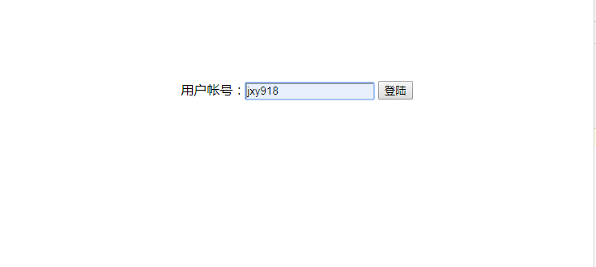
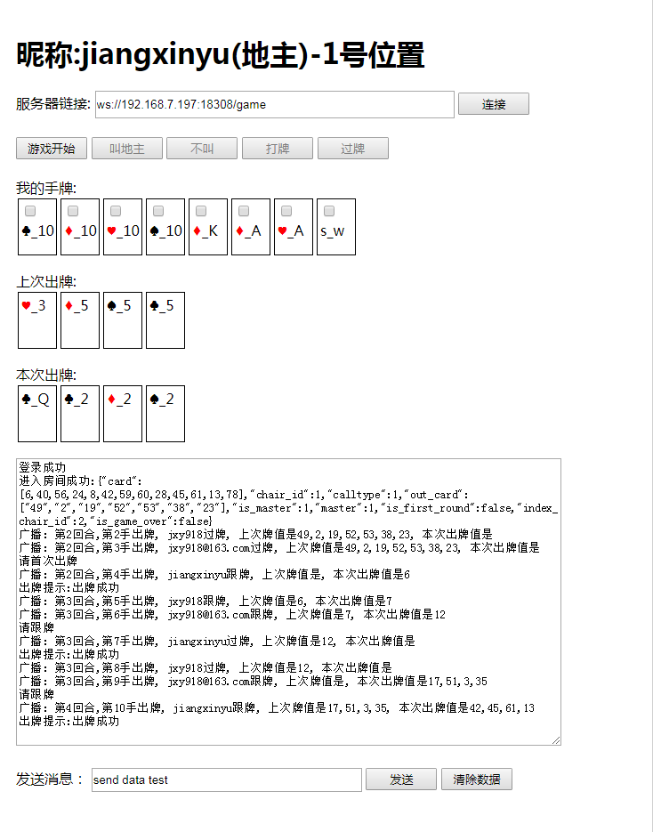
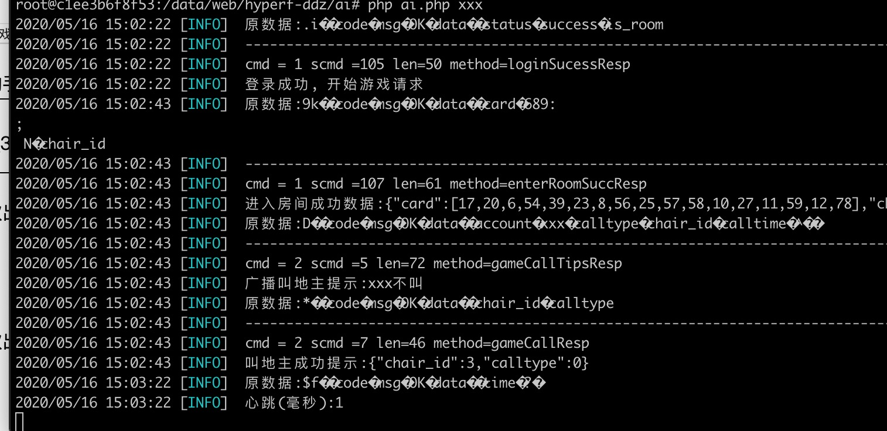

# swoft-ddz(斗地主)

* 基于swoft2.0框架开发游戏斗地主

* 使用swoft2.0框架基本实现斗地主游戏逻辑, 可以简单玩斗地主
* 客户端采用纯原生js编写, 实现简单的测试客户端, 没有任何动画效果
* 实现斗地主AI机器人简单逻辑,现在只能是过牌,比较弱智,可以简单陪打,机器人逻辑会慢慢完善

* 想关注更多游戏开发可以关注hyperf-ddz斗地主：**[hyperf-ddz](https://github.com/jxy918/hyperf-ddz)**

### 一，概述

* 使用swoft2.0开发实现斗地主游戏服务器逻辑, 并采用原生js实现简单的客户端打牌逻辑，基本可以做到简单玩斗地主游戏了, 并实现机器人AI逻辑编写, 全方面实现斗地主游戏逻辑。
* 整个斗地主逻辑实现是在redis里存储的, 并没有接入数据库, 数据库接入, 可以在游戏登录或者斗地主打牌完成, 接入。

### 二，示例图
1, 登录, 简单实现登录, 请随便输入英文或这数字账号, 现在直接是采用账号当uid使用存入redis的,如果接入数据库, 请自行通过账号替换成uid,登录如下图:


2, 打牌逻辑, 根据按钮来操作打牌逻辑, 消息框里会提示打牌逻辑过程,打牌逻辑如下图:


 
### 三，特性

* 实现前后端二进制封包解包，采用的是msgpack扩展，msgpack对数据进行了压缩，并实现粘包处理
* 数据采用固定包头，包头4个字节存包体长度，包体前2个字节分别为cmd(主命令字)，scmd(子命令字)，后面为包体内容
* 采用策略模式解耦游戏中的每个协议逻辑
* 实现定义游戏开发cmd(主命令字)和scmd(子命令字)定义，cmd和scmd主要用来路由到游戏协议逻辑处理
* 代码里有个DdzPoker类是一个款斗地主算法类.
* 多地主逻辑是单独目录是实现的, 可以方便迁移框架。
          
### 四，环境依赖

>依赖swoft环境，请安装php扩展msgpack
 
* php vesion > 7.0
* swoole version > 4.4.1   
* msgpack
* swoft vesion > 2.0

     
### 五，开始使用
* 1，安装

```
composer install

``` 

* 2，目录说明（swoft目录不具体说明）：

```
./app/Http/Controller/GameController.php		游戏http控制器逻辑
./app/Game		    是这个整体游戏服务器逻辑
./app/Game/Conf	    逻辑配置目录, 比如:命令字, 子名字, 路由转发
./app/Game/Core		游戏路由转发,算法,解包核心类
./app/Game/Logic	游戏路由转发逻辑协议包处理目录
./public/client				    客户端view的资源文件
./resources/views/game		    斗地主客户端
./app/Task/Task/GameSyncTask.php	  用户进入房间异步匹配处理逻辑
./app/Common/TcpReceiveListener.php	  重新覆盖tcp服务器路由到游戏处理逻辑, 此文件开tcp协议, 让斗地主逻辑支持tcp协议

``` 
         
* 3，进入根目录目录，启动服务器(swoft启动websocket启动法） ：

游戏服务器命令操作:

```
// 启动服务，根据
php bin/swoft ws:start

// 守护进程启动，覆盖 
php bin/swoft ws:start -d

// 重启
php bin/swoft ws:restart

// 重新加载
php bin/swoft ws:reload

// 关闭服务
php bin/swoft ws:stop

```  

机器人AI执行命令操作, 进入根目录下test目录下

```
//xxx表示用户账号
php ai.php  xxx   

```
> xxx 表示用户账号, 账号最好用英文加数字, 账号唯一就可以

> ai功能需要swoole开启短名称功能, 去php.ini添加：swoole.use_shortname=on



* 4，访问url:

```
//斗地主客户端入口
http://[ip]:[port]/game

```


### 六，联系方式

* qq：251413215，加qq请输入验证消息：swoft-ddz
qq群:100754069

### 七，备注

* 可以使用根目录增加docker运行环境(Dockerfile)， 可以直接执行下面的命令，创建镜像php_swoole, 环境增加php-protobuf，php-msgpack支持。 

```
docker build -t php_swoole .

```
* 注意如果程序不能自动加载，请去除环境中opcache扩展。
* 服务器增加支持TCP服务器，服务器启动就会监控TCP游戏服务器， 可以通过/test/tcp_client.php测试。

```
php ./test/tcp_client

```
    
* 请使用根目录下的Dockerfile可以直接跑, 如果使用swoft的Dockerfile需要自行安装msgpack扩展,  

### 八，增加录像直播功能, 此功能只是测试, 效果比较差

* 1, 视频录制url，如果电脑没有摄像头， 请用手机测试录制视频：

````
http://[ip]:[port]/camera
````

* 2，浏览器上播放视频url如下：

```
http://[ip]:[port]/show
```


